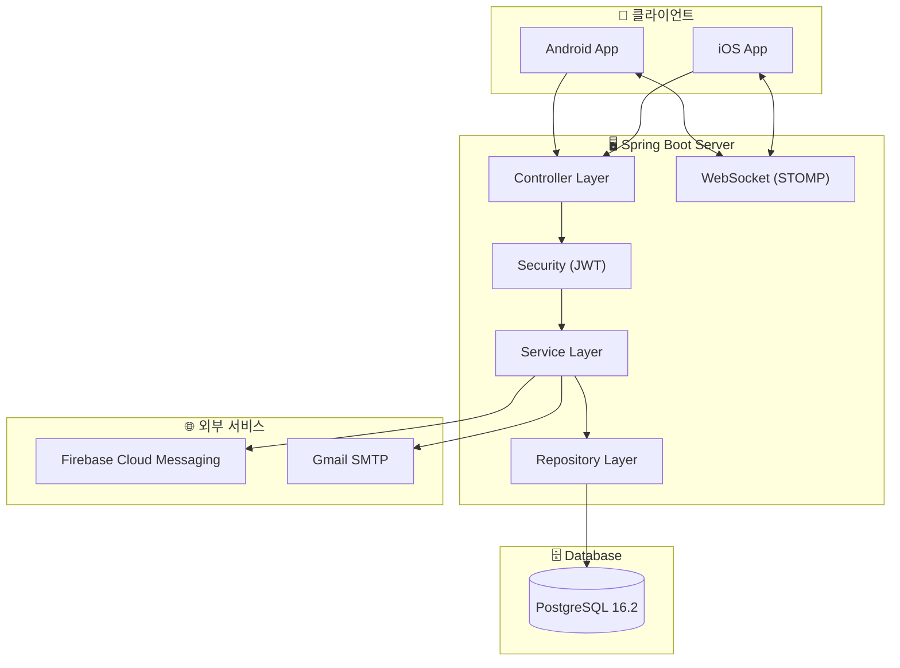
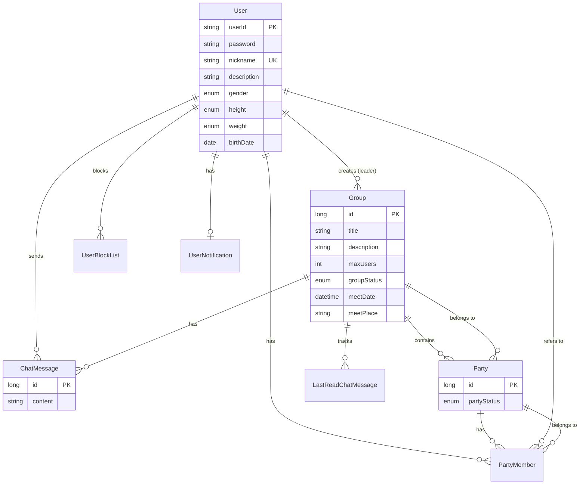
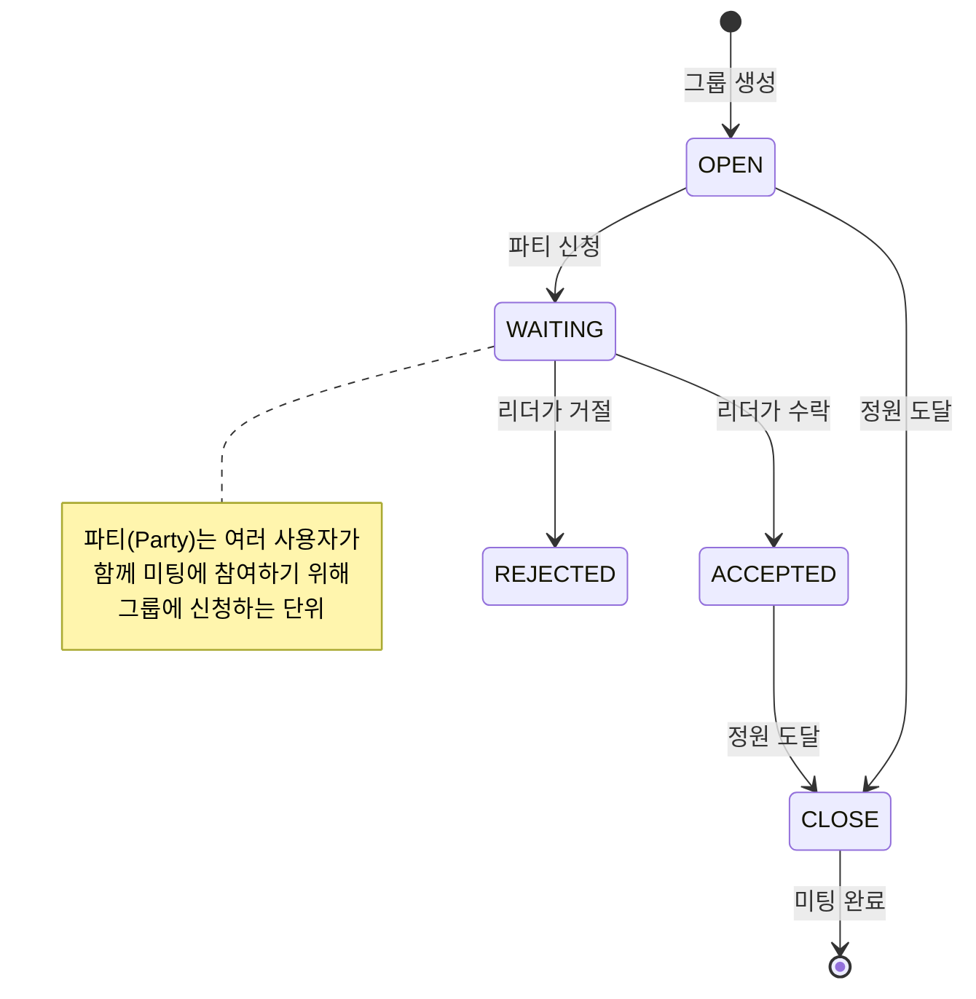
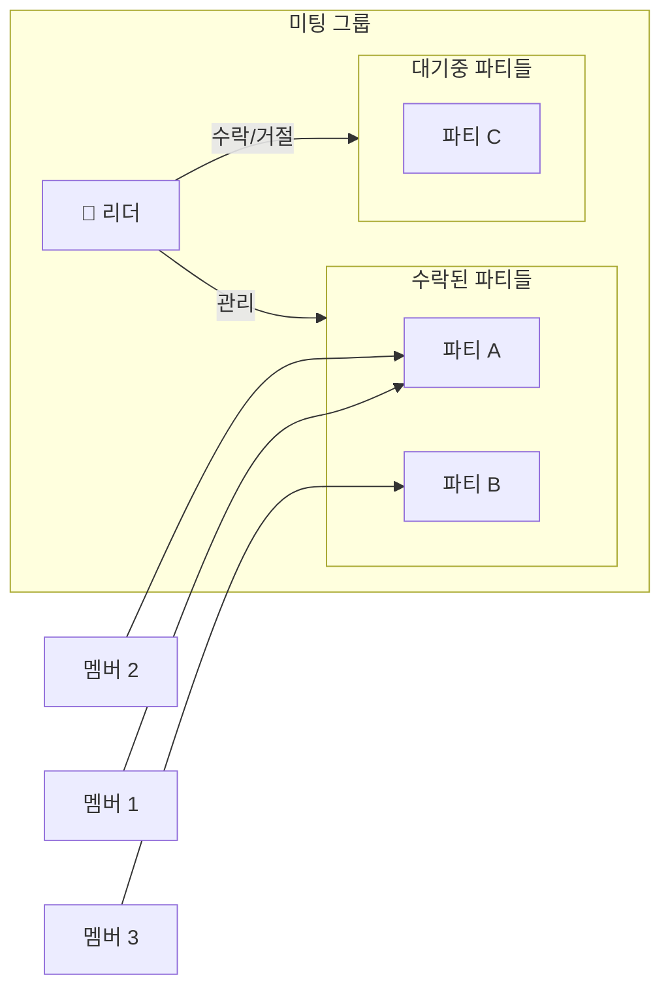

# 미티 (Miti) Backend

> **미팅 매칭 서비스 미티의 서버**  
> Kotlin + Spring Boot로 구축된 대학생 미팅 매칭 서비스 백엔드입니다.

<p align="center">
  <a href="https://play.google.com/store/apps/details?id=com.gcc.miti&pli=1">
    
  </a>
  <a href="https://apps.apple.com/kr/app/%EB%AF%B8%ED%8B%B0/id6478576518">
    
  </a>
</p>

---

## 📋 목차

- [기술 스택](#-기술-스택)
- [프로젝트 구조](#️-프로젝트-구조)
- [시스템 아키텍처](#️-시스템-아키텍처)
- [도메인 모델](#-도메인-모델)
- [API 문서](#-api-문서)
- [시작하기](#-시작하기)
- [환경 변수](#️-환경-변수)

---

## 🛠 기술 스택

| 영역 | 기술 |
|------|------|
| **Language** | Kotlin 1.9.22 |
| **Framework** | Spring Boot 3.2.3 |
| **Database** | PostgreSQL 16.2 |
| **ORM** | Spring Data JPA, Hibernate |
| **Migration** | Flyway |
| **Security** | Spring Security, JWT |
| **Real-time** | WebSocket (STOMP) |
| **Push** | Firebase Cloud Messaging (FCM) |
| **API Docs** | SpringDoc OpenAPI (Swagger UI) |
| **Mail** | Spring Mail (Gmail SMTP) |

---

## 🗂️ 프로젝트 구조

```
src/main/kotlin/com/gcc/miti/
├── MitiApplication.kt          # 애플리케이션 엔트리포인트
├── auth/                       # 인증/인가 도메인
│   ├── controller/             # REST API 컨트롤러
│   ├── dto/                    # 요청/응답 DTO
│   ├── entity/                 # EmailVerification, RefreshToken
│   ├── repository/             # JPA 리포지토리
│   ├── security/               # JWT, Spring Security 설정
│   ├── service/                # 비즈니스 로직
│   └── utils/                  # 유틸리티
├── user/                       # 사용자 도메인
│   ├── entity/                 # User, BannedUser, UserBlockList
│   └── ...
├── group/                      # 미팅 그룹 도메인
│   ├── entity/                 # Group, Party, PartyMember
│   └── ...
├── chat/                       # 채팅 도메인
│   ├── entity/                 # ChatMessage, LastReadChatMessage
│   └── ...
├── notification/               # 푸시 알림 도메인
│   ├── FCMConfig.kt            # Firebase 설정
│   └── ...
├── report/                     # 신고 도메인
├── archive/                    # 아카이브 (삭제된 데이터 보관)
└── common/                     # 공통 모듈
    ├── aop/                    # AOP (로깅 등)
    ├── configuration/          # 설정 클래스
    ├── entity/                 # BaseTimeEntity
    ├── exception/              # 예외 처리
    └── webhook/                # 외부 연동
```

---

## 🏛️ 시스템 아키텍처



---

## 📊 도메인 모델

### 핵심 도메인 관계



### 미팅 그룹 플로우



### 그룹 참여 구조



---

## 📑 API 문서

서버 실행 후 Swagger UI에서 API 문서를 확인할 수 있습니다:

```
http://localhost:8080/swagger-ui.html
```

---

## 🚀 시작하기

### 사전 요구사항

- **Java 17** 이상
- **Docker** (PostgreSQL 실행용)

### 로컬 개발 환경 설정

1. **저장소 클론**
   ```bash
   git clone https://github.com/GachonCodingClub/miti-backend.git
   cd miti-backend
   ```

2. **PostgreSQL 실행 (Docker)**
   ```bash
   docker-compose up -d
   ```

3. **환경 변수 설정**


4. **서버 실행**
   ```bash
   ./gradlew bootRun
   ```


---

## ⚙️ 환경 변수

| 변수명 | 설명 | 필수 |
|--------|------|------|
| `DB_URL` | PostgreSQL 접속 URL | ✅ |
| `DB_PASSWORD` | 데이터베이스 비밀번호 | ✅ |
| `PROFILE` | 스프링 프로필 (`dev`, `prod`) | ✅ |
| `MAIL_URL` | Gmail 이메일 주소 | ✅ |
| `MAIL_PASSWORD` | Gmail 앱 비밀번호 | ✅ |

> **Note**: Firebase 설정을 위해 `firebase-admin` 서비스 계정 JSON 파일이 필요합니다.

---
